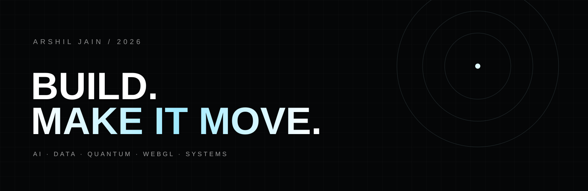

  

  

---

## 00 / SIGNAL

I build where engineering, mathematics, data, and visual design overlap.

**AI / ML · Data Science · Algorithms · Quantum Computing · Qiskit · Three.js · WebGL · GLSL · Automation**

The loop is simple:

~~~text
IDEA
  ↓
PROTOTYPE
  ↓
BREAK IT
  ↓
UNDERSTAND WHY
  ↓
REBUILD IT
  ↓
SHIP
~~~

## 01 / TOOLBOX

~~~text
LANGUAGES
Python · TypeScript · JavaScript · C/C++ · SQL · R

AI / DATA
PyTorch · NumPy · pandas · scikit-learn · Jupyter

QUANTUM
Qiskit · Linear Algebra · Quantum Algorithms

CREATIVE
React · Next.js · Three.js · WebGL · GLSL · GSAP

SYSTEMS
Git · Linux · APIs · Automation · CI/CD
~~~

## 02 / SELECTED WORK

### ◉ Lusion Systems Architecture
**https://github.com/arshiljain/lusionw**

Technical research into interactive graphics architecture: custom GLSL, GPGPU simulation, screen-space techniques, runtime behavior, and mathematical geometry.

### ◇ Algorithm Laboratory
**https://github.com/arshiljain/DSAPP**

A growing implementation lab for algorithms and computational experiments, including binary-search boundaries, sorting, heaps, string matching, graphs, ML from scratch, quantitative finance, game theory, and Qiskit.

### △ Portfolio / Creative Web
**https://github.com/arshiljain/portfolio**

Art-directed frontend experiments focused on motion, typography, composition, interaction, and the feeling of a digital space.

### ⌘ Developer Lab
**https://github.com/arshiljain/Github-Bot**

Private workspace for GitHub tooling, automation, and developer experiments.

---

## 03 / PROJECT WALL

| DOMAIN | PROJECTS |
|---|---|
| WebGL | Lusion Systems · Lusion · Detroit · Obys Study |
| AI | AI Website Cloner · ML experiments |
| Algorithms | Algorithm Laboratory · graph / string / DP work |
| Quantum | Qiskit circuits · Grover · QFT · QPE experiments |
| Quant | Monte Carlo · Black–Scholes · numerical experiments |
| Game Theory | Prisoner's Dilemma · Nash equilibrium experiments |
| Frontend | Portfolio · interactive landing pages · motion studies |

> Some repositories are studies or forks. They are presented separately from original projects so the distinction stays clear.

---

## 04 / GITHUB ACTIVITY

  

---

## 05 / CURRENT ARC

~~~text
ALGORITHMS      ██████████
QUANTUM         ████████░░
AI / ML         ████████░░
CREATIVE WEB    ██████████
SYSTEMS         ██████░░░░
RESEARCH        ███████░░░
~~~

The goal is not to look busy.

**The goal is to leave a trail of interesting things.**

---

### MAKE IT USEFUL.
### MAKE IT BEAUTIFUL.
### THEN MAKE IT STRANGE.

arshiljain · 2026

